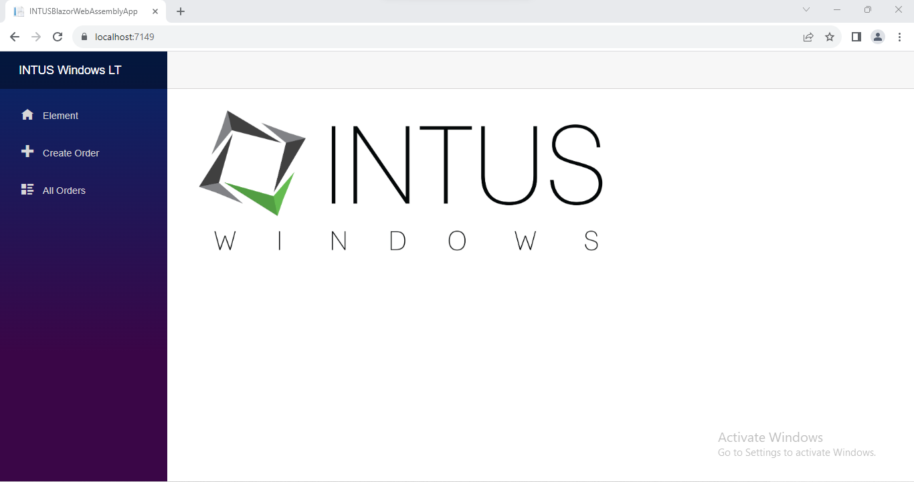
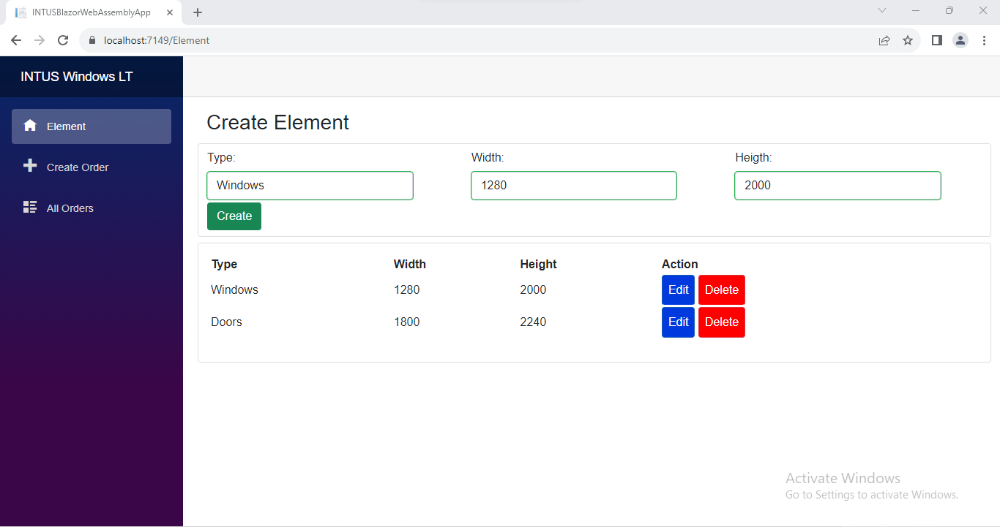
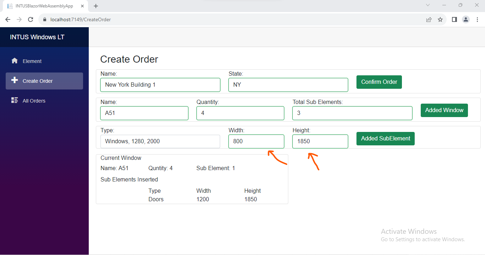
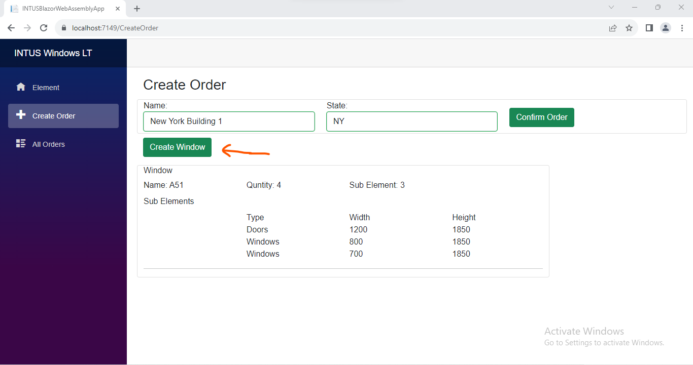
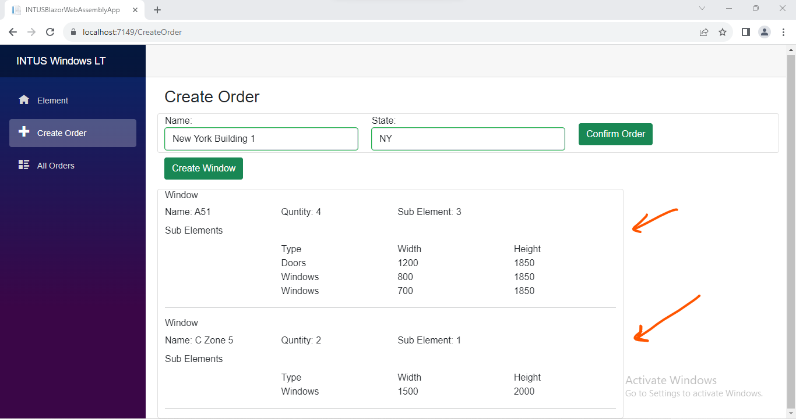
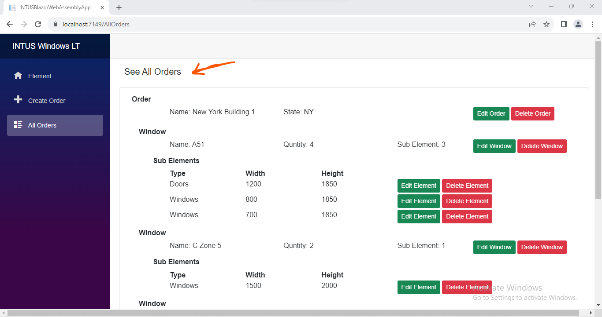

# Simple Web Application 
- How to Setup Environment
1.  Download the Project
2.   Blazor WebAssembly and Web API on .NET 6
3.  Database Backup Restore 
    - First Visual Studio open project then define **appsettings.json** connection string mention server name and database name 
    - Microsoft Sql server Management open and **INTUSManagement1.bak** file for restore Database
    - Or Code first approach use to Nuget Package Manager console open and run **update-database** for migration 
4.  Run the Prject **F5** or blue icon in visual studio 

#
## Home Page:

## Create New Element
- When we generate a new element during the order creation process, we utilize this element to facilitate a more straightforward and convenient selection method. 

## Create Order 
- Here, we establish a window and populate it with numerical or subordinate elements. Additionally, we generate multiple windows in the process.

- We can change the Width and Height or Elements 

- Create multipule window

## View Order 
- We can view all orders that include multiple sub-orders within a parent order window, where each window comprises various sub-elements.

## Thank You For Your Time. 